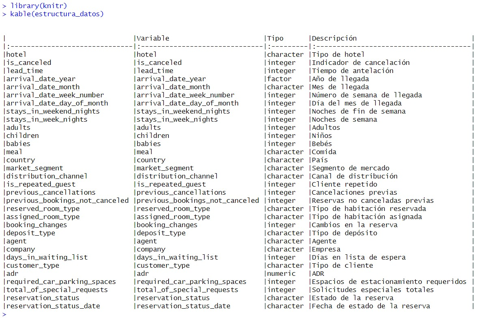

# CC216-TP-2024-1

## Trabajo Parcial

**Curso: Fundamentos de Data Science** 
**Dataset: Hotel Bookings**

## Objetivo del trabajo

El objetivo principal del trabajo es realizar un análisis exploratorio del conjunto de datos propuesto al preparar los datos, crear visualizaciones y obtener inferencias con el objetivo de comprender el comportamiento de las reservas hoteleras, utilizando datos provenientes de los sistemas de gestión de propiedades (PMS) de dos hoteles ubicados en Portugal.

Con este fin, se busca identificar patrones de reserva, tendencias temporales y preferencias de los clientes en función del tipo de hotel.

Este análisis no solo tiene implicaciones prácticas para profesionales de la industria hotelera, sino que también contribuye al avance de la investigación en áreas como el aprendizaje automático y la gestión de datos en el contexto hotelero.

## Participantes
|Codigo         |Nombre                         |
|-------------|------------------------------ |
| `u202210494`| Alfredo Mauricio Aragón Ovalle  |
| `u201625763`| Tomás Edgar Ninán Melo  |
| `u202111660`| José Guillermo Melgar Puertas|
| `u202216562`| Rody Sebastian Vilchez Marin |

## Descripción del dataset

Para describir nuestro conjunto de datos, llevamos a cabo un análisis exhaustivo de cada variable disponible.

Para garantizar una presentación ordenada y precisa, empleamos la librería `knitr`, la cual nos permitió crear una tabla que contiene las variables, sus tipos y una breve descripción de cada una. La tabla se estructura en las siguientes columnas:

`Variable`: Nombre de la variable en los datos. 
`Tipo`: Tipo de datos de la variable. 
`Descripción`: Breve descripción de la variable y su significado. 

## Informe detallado del analisis

[upc-pre-2401-1-tp1.pdf](upc-pre-2401-1-tp1.pdf)

## Conclusiones

1. Respecto a las reservas por tipo de hotel, se observa que los hoteles tipo City tienen una demanda significativamente mayor que los hoteles tipo Resort, con más del doble de reservas realizadas. Este análisis revela una preferencia marcada por los hoteles urbanos sobre los resorts. 

1. Sobre la evolución de la demanda efectiva hasta la fecha, se evidencio un sorprendente crecimiento inicial al 2016, sin embargo el crecimiento se desaceleró constantemente hasta el 2017. De cara al futuro, los datos analizados auguran la agudización de la situación con una próxima disminución de la demanda efectiva.

1. Durante los meses de Noviembre, Diciembre, Enero y Febrero, que conforman la temporada baja. Enero destaca como el mes con la menor cantidad de reservas, representando el 4.97% del total anual.
De un total de 115,083 reservas analizadas, solo el 7.49% incluyen niños y/o bebés, ello sugiere que la mayoría de las reservas se realizan para adultos sin compañía de menores de edad.
1. Se observa una variabilidad en la cantidad de espacios de estacionamiento requeridos según el tipo de hotel, teniendo los hoteles resort una predominante dominancia, a pesar de tener menos demanda.
1. Existe una correlación entre la temporada de mayor demanda de reservas (temporada media y alta) y el aumento en la cantidad de cancelaciones. Los meses desde Abril hasta Octubre muestran el mayor número de cancelaciones, Agosto el mes con la mayor cantidad registrada (5235 cancelaciones), lo que sugiere una relación directamente proporcional entre la cantidad de reservas y las cancelaciones.

## Licencia

El dataset utilizado se encuentra bajo una licencia [Creative Commons](https://creativecommons.org/licenses/by/4.0/):
> Nuno Antonio, Ana de Almeida, Luis Nunes, 
> Hotel booking demand datasets, 
> Data in Brief, 
> Volume 22, 
> 2019, 
> Pages 41-49, 
> ISSN 2352-3409, 
> [https://doi.org/10.1016/j.dib.2018.11.126](https://www.sciencedirect.com/science/article/pii/S2352340918315191)
